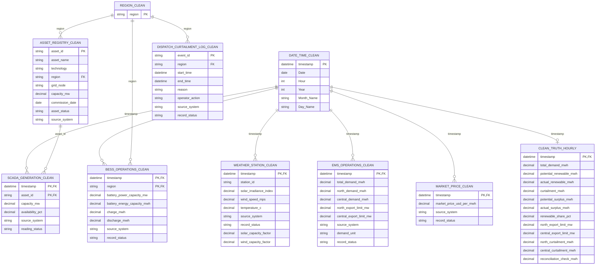

# GreenGrid v2.2 clean-data model for `clean_truth_hourly`

This ERD models the CSV tables that actually exist in
`clean_data/`, plus `clean_truth_hourly` as the output to construct. The
relationships use logical keys; CSV files do not enforce foreign keys.

## ERD

The table names correspond to the clean CSV filenames without the `.csv`
suffix. `DATE_TIME_CLEAN.timestamp` is the hourly spine; join it to the
timestamp columns above after parsing `date_time_clean.csv` values to the same
datetime format as the ISO-formatted source timestamps.

## Join and calculation path

1. **Per-asset potential generation:** join SCADA to the asset registry on
   `asset_id`, and to weather on `timestamp`. Use the asset technology to
   select solar or wind capacity factor, then calculate:

   `capacity_mw * capacity_factor * availability_pct / 100`

   Group/sum this result by `timestamp` and asset region.
2. **Regional dispatch:** map EMS regional demand and export-limit columns to
   their respective regions, then join BESS on `(timestamp, region)`. For
   each region and timestamp, the generator calculates
   `actual = min(potential, regional_demand + export_limit + charge)` and
   `curtailment = potential - actual`.
3. **Hourly truth:** sum potential, actual, and curtailment across assets for
   each timestamp. Sum regional curtailment by timestamp, preserving North
   and Central values separately. Join the EMS values by timestamp, then
   calculate:
   - `potential_surplus_mwh = max(potential_renewable_mwh - total_demand_mwh, 0)`
   - `actual_surplus_mwh = max(actual_renewable_mwh - total_demand_mwh, 0)`
   - `renewable_share_pct = actual_renewable_mwh / total_demand_mwh * 100`
   - `reconciliation_check_mwh = potential_renewable_mwh - actual_renewable_mwh - curtailment_mwh`

## Tables not used to calculate this target

- `market_price_clean.csv` is keyed by timestamp, but market price is not an
  input to or output of `clean_truth_hourly`.
- `dispatch_curtailment_log_clean.csv` is an event-level summary. Its
  start/end times and reason do not provide hourly curtailed MWh, so it cannot
  replace the hourly generation/dispatch calculations.
- `region_clean.csv` is the lookup for the region values used by assets,
  BESS, and dispatch events. EMS stores regional measures in separate columns,
  not in rows keyed by region.

## Important limitation of the current files

The current clean files do not contain a complete set of rows for every
timestamp/entity combination: the date/time table has 8,760 hours, compared
with 8,725 weather rows, 8,743 EMS rows, 52,456 SCADA rows (104 short of six
assets for every hour), and 17,469 BESS rows (51 short of two regions for
every hour). Check and resolve these gaps before joining; otherwise an inner
join will drop hours and a left join will leave missing calculation inputs.

Also, SCADA does not store per-asset capacity factor or generated MWh. Although
the cleaned weather table contains capacity-factor columns, the generator
creates a separate randomized solar capacity factor for each asset. Therefore
the checked-in clean tables can describe and approximate the calculation
model, but cannot reproduce the reference truth exactly from those files
alone. Exact reproduction requires preserving the generator's per-asset
capacity factors/potential MWh and hourly regional dispatch results.
