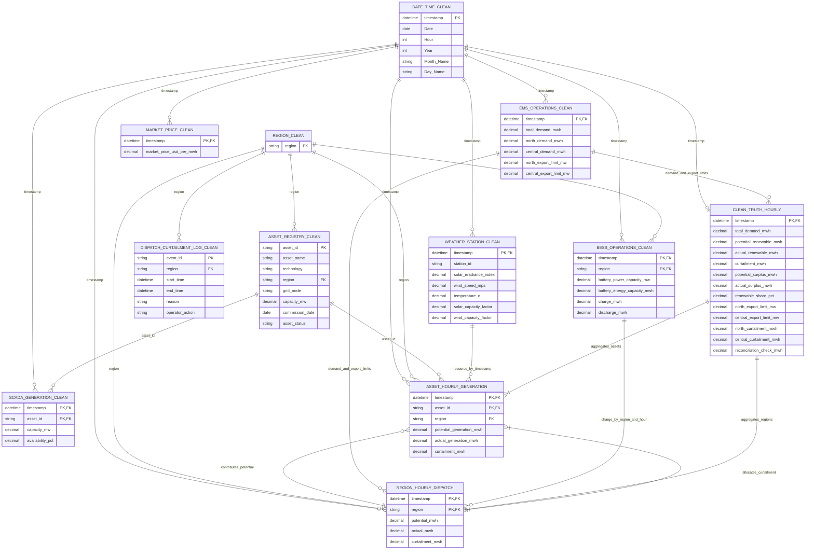

# GreenGrid v2.2 — `clean_truth_hourly` ERD

This diagram describes the lineage from the cleaned CSV extracts to the
hourly truth table produced by `SystemOperationsModel.build_clean_truth()`.
The source files are flat CSVs, so the keys and relationships below are
logical rather than database-enforced constraints.

## Entity relationship diagram

`ASSET_HOURLY_GENERATION` and `REGION_HOURLY_DISPATCH` are transformation
stages, not CSVs currently present in `clean_data`. `MARKET_PRICE_CLEAN` is
shown as a timestamped source table, but market price is not selected into or
used to calculate `clean_truth_hourly`. The dispatch log contains event
intervals and reason labels; it does not contain one row or a curtailed-energy
value for every hour, so it is not the hourly curtailment fact.

## Transformation path

1. Use `DATE_TIME_CLEAN.timestamp` as the hourly output spine. Parse its
   locale-formatted values (for example, `01/01/2025 0:00`) to the same
   datetime type/zone as the ISO timestamps in the other extracts.
2. Join SCADA on `(timestamp, asset_id)` to the asset registry on `asset_id`,
   and to weather on `timestamp`. Group asset generation by `(timestamp,
   region)` for the dispatch calculation.
3. Calculate potential output per asset as
   `capacity_mw * capacity_factor * availability_pct / 100`. In the generator,
   wind capacity factor is calculated from wind speed; solar capacity factor
   is sampled separately for each asset from irradiance and a random
   multiplier.
4. Join hourly regional potential to EMS regional demand/export limits and
   BESS charge by `(timestamp, region)`. The generator calculates regional
   absorption as `demand + export_limit + charge`, actual generation as the
   lesser of potential and absorption, and curtailment as potential minus
   actual. It allocates regional curtailment back to assets in proportion to
   each asset's share of regional potential.
5. Aggregate asset generation and regional dispatch to one row per timestamp.
   Calculate:
   - `potential_surplus_mwh = max(potential_renewable_mwh - total_demand_mwh, 0)`
   - `actual_surplus_mwh = max(actual_renewable_mwh - total_demand_mwh, 0)`
   - `renewable_share_pct = actual_renewable_mwh / total_demand_mwh * 100`
   - `reconciliation_check_mwh = potential_renewable_mwh - actual_renewable_mwh - curtailment_mwh`
6. Select those fields plus the EMS demand and export-limit fields to form
   `CLEAN_TRUTH_HOURLY`. The reconciliation field should be zero, subject to
   floating-point tolerance.

## Reproducibility caveats in the current clean extracts

The current CSVs do not support an exact, complete reconstruction of the
reference `clean_truth_hourly.csv` without restoring or deriving missing data:

- The date/time spine has 8,760 rows, but weather has 8,725, EMS has 8,743,
  market has 8,744, SCADA has 52,456 (104 fewer than 6 assets × 8,760 hours),
  and BESS has 17,469 (51 fewer than 2 regions × 8,760 hours).
- SCADA stores capacity and availability, not the per-asset capacity factor,
  potential MWh, actual MWh, or curtailment MWh. The clean weather file's
  shared solar capacity-factor column cannot reproduce the generator's
  independently randomized per-asset solar factors exactly.
- The clean EMS and BESS files contain inputs to dispatch, not hourly
  regional potential, actual generation, or curtailment. Event intervals in
  the dispatch log cannot recover those missing hourly amounts.

Consequently, this ERD documents the intended lineage and required joins, but
the existing clean files alone cannot regenerate the reference truth exactly.
For reproducible output, retain the generator's per-asset hourly capacity
factor/potential generation and hourly regional dispatch outputs (or persist
the corresponding derived measures in clean source extracts), and resolve the
missing timestamp/entity rows before joining.
